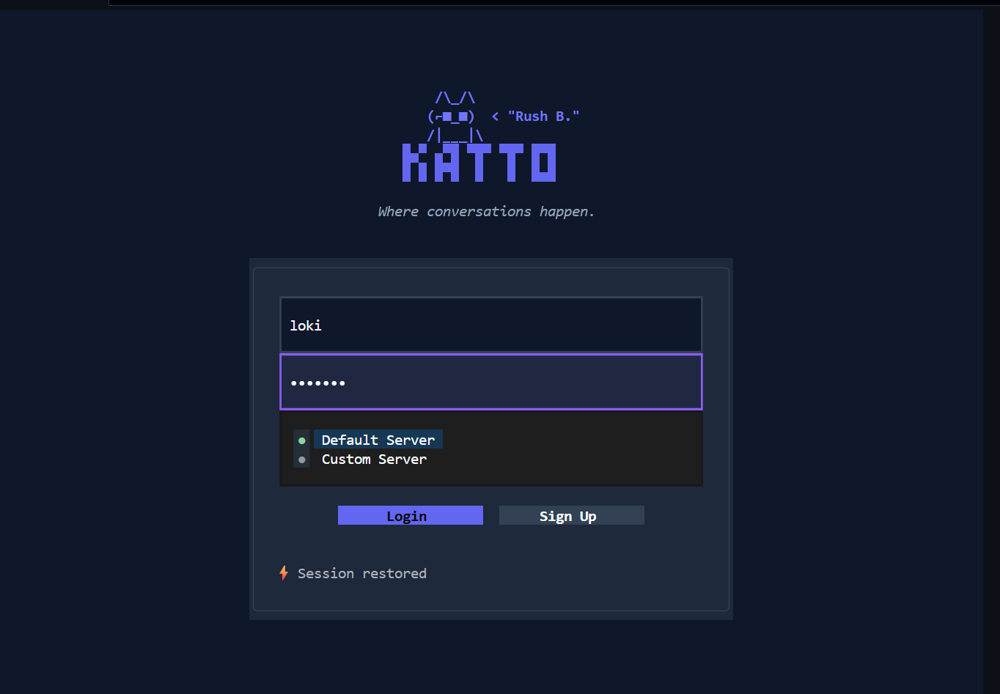
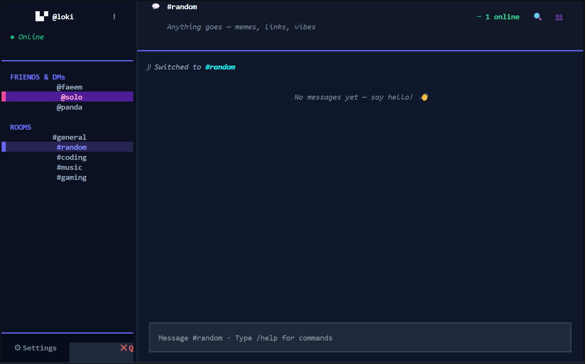
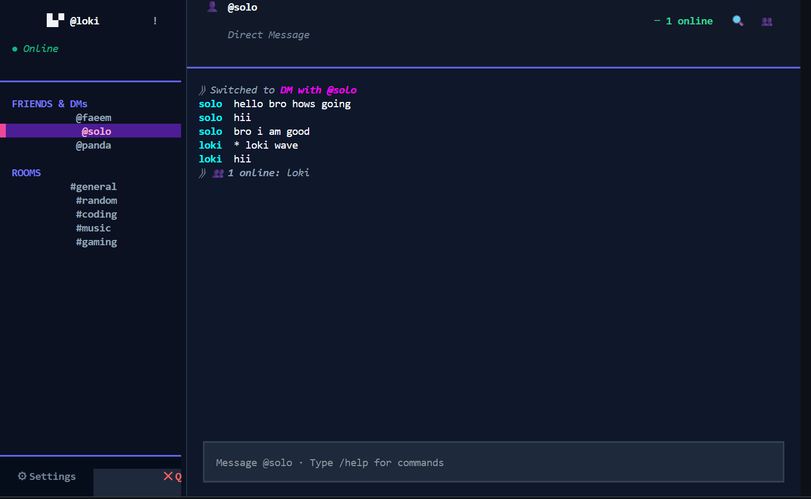
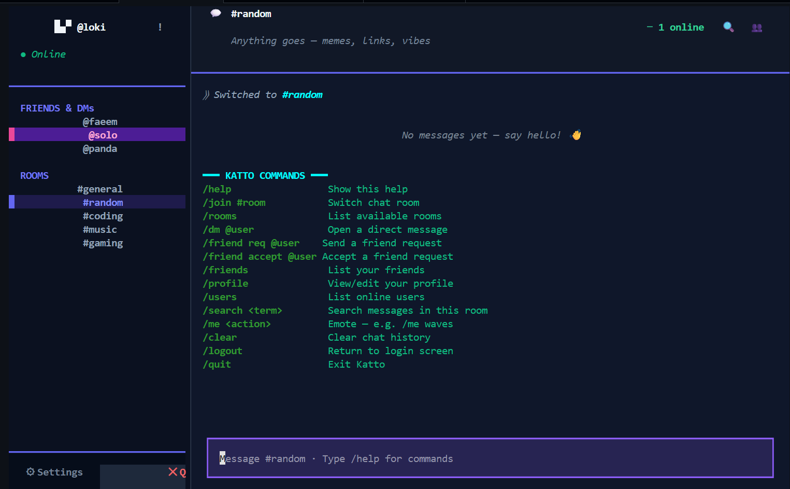

# 🐾 Katto
**Terminal Social Chat**

Bringing people together, one message at a time. A modern, Discord-like chat application built entirely for the terminal using Textual.

## 📝 About
Katto is a full-featured terminal chat application that brings real-time messaging to your command line. Built with Python and [Textual](https://textual.textualize.io/), it provides a modern, interactive TUI experience comparable to desktop chat clients like Discord, but entirely within your terminal. Perfect for developers, sysadmins, and terminal enthusiasts who want to stay connected without leaving their shell.

## ✨ Features
- **Modern TUI:** Beautiful, interactive interface that feels like a modern web app but lives in your terminal.
- **Global & Private Rooms:** Chat in `#general`, `#coding`, `#gaming`, etc.
- **Direct Messaging:** Send DMs privately to other users.
- **Friend System:** Send friend requests, accept/decline, and see who is online.
- **Live Updates:** See when other users are typing and get real-time message updates via WebSockets.
- **Slash Commands:** Fully powered by `/commands` for easy navigation and power use.

---

## 🚀 Installation Guide

### Option 1: The Easy Way (Use `pipx`)
If you just want to run the app as a command-line tool, we recommend using [pipx](https://pypa.github.io/pipx/).

```bash
# Install directly from the repository
pipx install git+https://github.com/faeemaxp/katto.git

# Run it!
katto
```

### Option 2: Clone and Install
If you want to look at the code or contribute to it:

```bash
# 1. Clone the repository
git clone https://github.com/faeemaxp/katto.git
cd katto

# 2. Install using pip
pip install -e .

# 3. Launch the app
katto
```

---

## 📸 Screenshots

| Login Screen | Main Dashboard |
| :---: | :---: |
|  |  |
| *Create account or log in with custom server support* | *Real-time chat with friends, DMs, and public rooms* |

| Direct Messaging | Commands Reference |
| :---: | :---: |
|  |  |
| *Private 1-on-1 conversations with friends* | *Complete slash command reference* |

---

## 💬 Command Reference
Type `/help` anywhere in the app to see all available commands.

- `/join #room` — Switch to a public room (e.g. `/join #coding`)
- `/rooms` — See a list of all available rooms
- `/users` — See who is currently online
- `/dm @username` — Open a private chat with someone
- `/friend req @username` — Send a friend request
- `/friend accept @username` — Accept a friend request
- `/friends` — View your friend list and pending requests
- `/profile` — View/edit your settings and profile status
- `/me <action>` — Send a roleplay/action message (e.g. `* panda smiles`)
- `/search <term>` — Search current chat history
- `/clear` — Clear your local chat view
- `/quit` / `/logout` — Exit the app

---

## 🛠️ For Developers: Running the Server

Katto is a client-server application. By default, the client connects to the cloud server, but you can run your own server locally for development.

### Prerequisites
- Python 3.11+
- MongoDB (for local development)
- pip / pipenv

### Local Server Setup
1. Navigate to the `server/` directory:
   ```bash
   cd server
   ```

2. Install backend dependencies:
   ```bash
   pip install -r requirements.txt
   ```

3. Ensure MongoDB is running locally (or update the connection string in the server code).

4. Start the local server:
   ```bash
   uvicorn main:app --reload
   ```
   The server will be available at `http://127.0.0.1:8000`

5. Update the client to use your local server:
   - Edit `client/app.py` and change `DEFAULT_SERVER = "katto-server-production.up.railway.app"` to `DEFAULT_SERVER = "127.0.0.1:8000"`
   - Or log in using the custom server option in the login screen

### Project Structure
```
katto/
├── client/              # Textual TUI application
│   ├── app.py          # Main client application
│   ├── chat_ui.tcss    # Styling (Textual CSS)
│   └── ui_assets.py    # UI assets and constants
├── server/             # FastAPI backend
│   ├── main.py         # Server entry point
│   ├── database.py     # Database models and operations
│   └── requirements.txt # Python dependencies
└── pyproject.toml      # Package configuration
```

---

## � Requirements

### Client
- Python 3.10+
- Textual (TUI framework)
- httpx (async HTTP client)
- websockets (WebSocket support)

### Server
- Python 3.11+
- FastAPI
- Uvicorn
- Motor (async MongoDB driver)
- PyMongo

---

## 🏗️ Tech Stack
- **Frontend (TUI):** [Textual](https://textual.textualize.io/) - A powerful Python TUI framework
- **Backend:** [FastAPI](https://fastapi.tiangolo.com/) - Modern, fast web framework
- **Database:** MongoDB - NoSQL database
- **Real-time Messaging:** WebSockets
- **HTTP Client:** httpx - Async HTTP client

---

## 🤝 Contributing
We welcome contributions! Feel free to:
- Report bugs and issues
- Suggest new features
- Submit pull requests
- Improve documentation

Please follow the existing code style and add tests for new features.

---

## �📜 License
Distributed under the MIT License. See `LICENSE` for more information.
